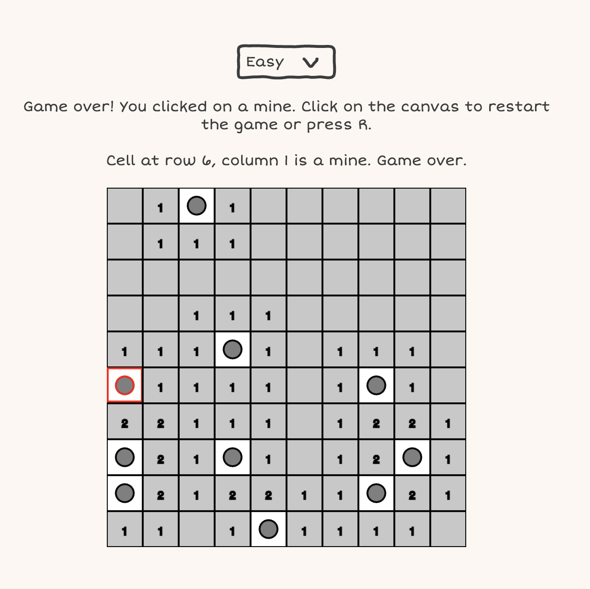

# Minesweeping with TypeScript

Done for educational purposes. Deploy [here]()

This is an attempt to start doing more web accessible games using Canvas. In this case, we have the classic minesweeper.

## Features

- √ Accessible completely through keyboard and mouse
- √ Three levels of difficulty
- √ Created by using TypeScript and TSDocs
- √ Live information of the game using ARIA
